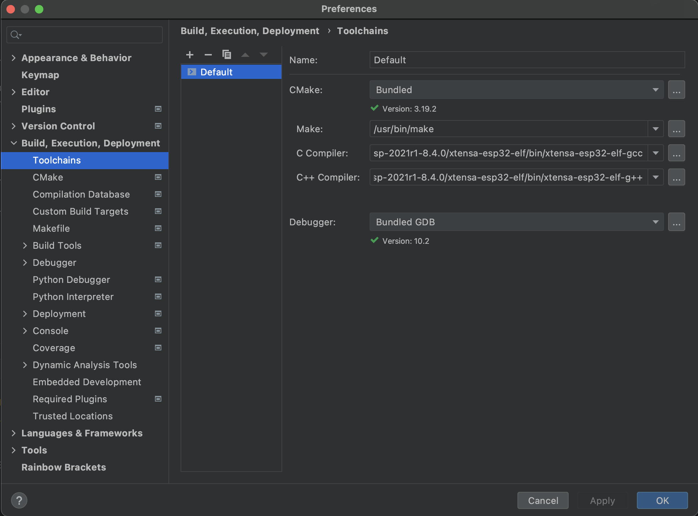
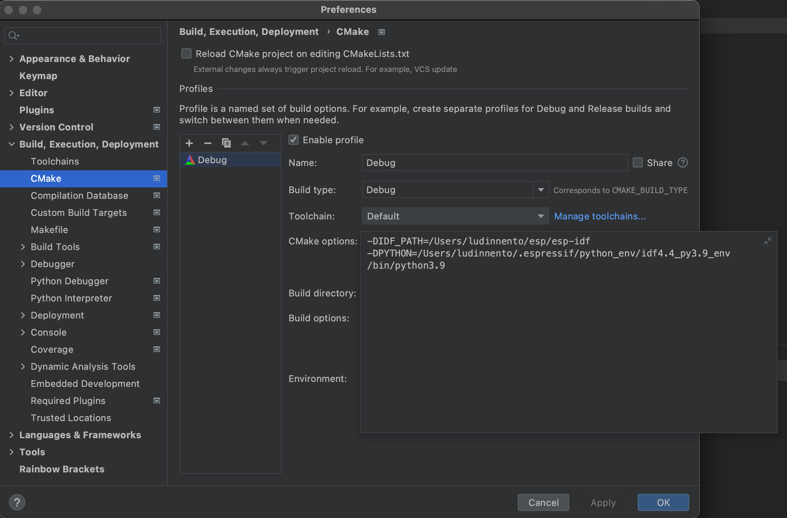
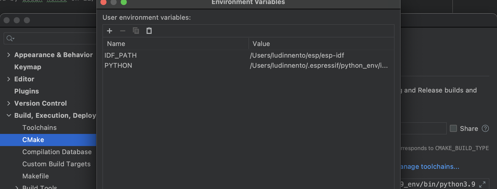
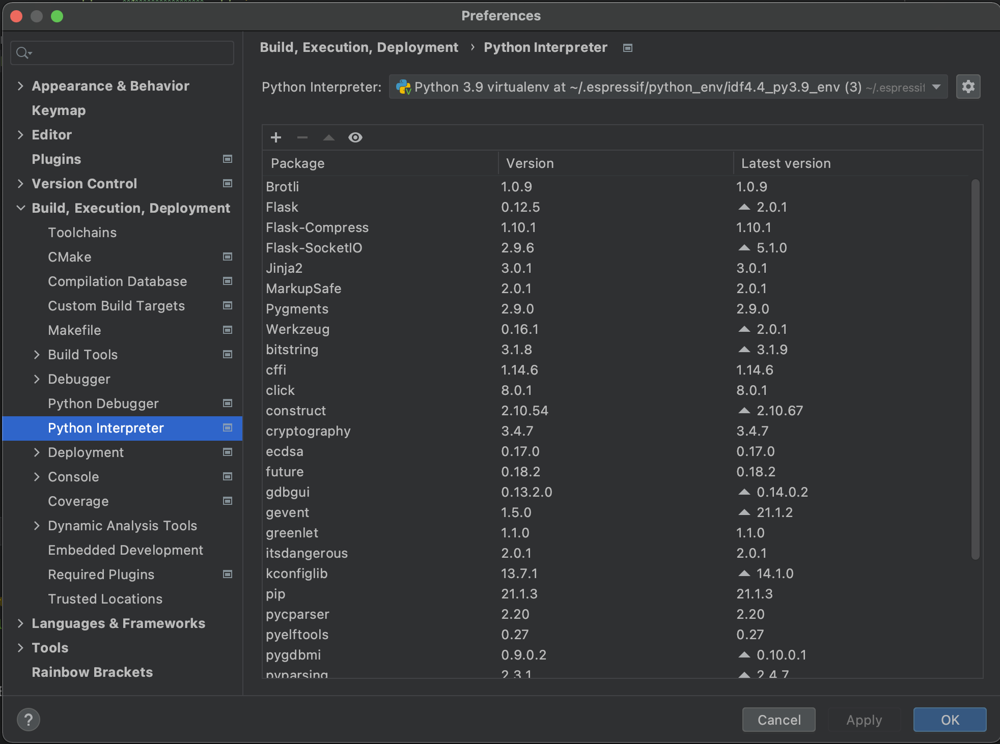
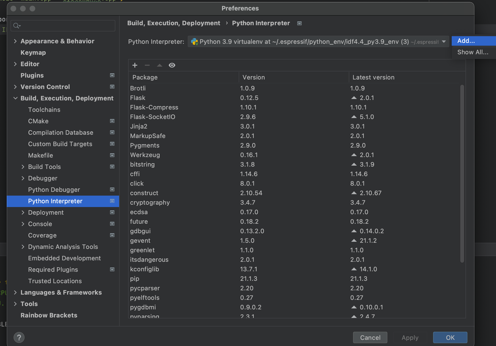
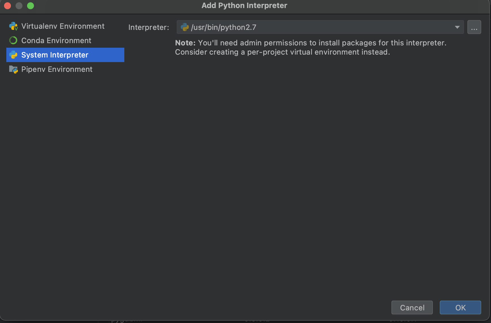
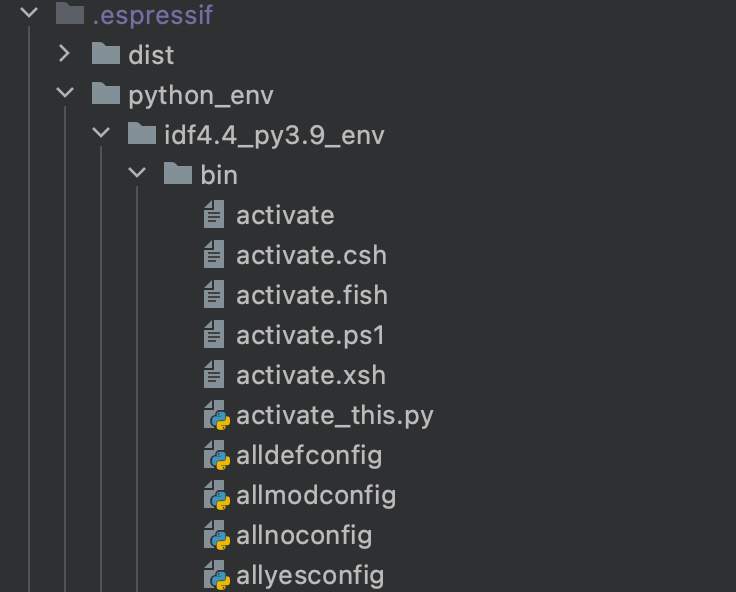

# esp-idf-clion
configuration and setup clion with esp-idf

## Install and setup esp idf
1. Create directory esp
```
mkdir -p ~/esp
cd ~/esp
git clone --recursive https://github.com/espressif/esp-idf.git
```

2. change directory to esp-idf
```
cd ~/esp/esp-idf
```

3. run script install.sh
```
./install.sh
```

## Set up a sample project using CLion

1. Open clion IDE and make new project
2. Setup clion toolchain and cmake configuration **Build, Execution, Deployment**

    ### Setup clion toolchain
    Select **Toolchains** and change C Compiler and C++ Compiler with esp-idf compiler

     

    **Example :**

    **C Compiler** = /Users/your_user/.espressif/tools/xtensa-esp32-elf/esp-2021r1-8.4.0/xtensa-esp32-elf/bin/xtensa-esp32-elf-gcc

    **C++ Compiler** = /Users/your_user/.espressif/tools/xtensa-esp32-elf/esp-2021r1-8.4.0/xtensa-esp32-elf/bin/xtensa-esp32-elf-g++

      ### Setup clion CMake

        
      **1. Add IDF_PATH and PYTHON in CMake options**
            **Example : **
            **-DIDF_PATH** = /Users/your_user/esp/esp-idf 

            **-DPYTHON** = /Users/your_user/.espressif/python_env/idf4.4_py3.9_env/bin/python3.9

             

      **2. Add IDF_PATH and PYTHON on Environment**
            **Example : **
            **IDF_PATH**=/Users/ludinnento/esp/esp-idf

            **PYTHON**=/Users/ludinnento/.espressif/python_env/idf4.4_py3.9_env/bin/python3.9

                     

      ### Setup Python Interpreter

      **1. Select **Python Interpreter**

             
      **2. Add** 

            
      **3. Select System Interpreter**

            
      **4. Search and choose python binary in .espressif/python_env/idf4.4_py3.9_env/bin/python3.9**

            
    
4. Create directory main

    In this directory contain main.cpp or main.c of your esp program
    
    after create main.c/main.cpp, add another CMakeList.txt in this directory
    ```
    set(SOURCES "main.cpp")

    idf_component_register(SRCS ${SOURCES}
    INCLUDE_DIRS "")
        
    ```
    
5. Add CMakeList.txt inside application project

    ```
    cmake_minimum_required(VERSION 3.5)

    include($ENV{IDF_PATH}/tools/cmake/project.cmake)

    #set(CMAKE_FIND_ROOT_PATH /Users/your_user/.espressif/tools/xtensa-esp32-elf/esp-2021r1-8.4.0/xtensa-esp32-elf)
    set(CMAKE_C_COMPILER /Users/your_user/.espressif/tools/xtensa-esp32-elf/esp-2021r1-8.4.0/xtensa-esp32-elf/bin/xtensa-esp32-elf-gcc)
    set(CMAKE_ASM_COMPILER /Users/your_user/.espressif/tools/xtensa-esp32-elf/esp-2021r1-8.4.0/xtensa-esp32-elf/bin/xtensa-esp32-elf-g++)
    set(CMAKE_C_COMPILER /Users/your_user/.espressif/tools/xtensa-esp32-elf/esp-2021r1-8.4.0/xtensa-esp32-elf/bin/xtensa-esp32-elf-gcc)

    project(esp32t)

    include_directories("src")
    ```
6. Set up esp-idf environment variables
    Open Clion Terminal, and running
    ```
    . $HOME/esp/esp-idf/export.sh
    ```

7. Set up project
    In CLion terminal running : 
    ```
    idf.py set-target esp32
    ```
    and
    ```
    idf.py menuconfig
    ```
    menuconfig used for configuration esp-idf 

7. Build esp project
    In CLion terminal running : 
    ```
    idf.py build
    ```

8. Flash
     ```
     idf.py -p ESP-PORT -b 115200 flash 
     ```

9. Monitor
    ```
    idf.py -p ESP-PORT -b 115200 monitor  
